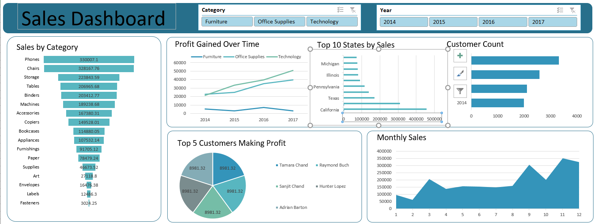

# 📊 Sales Data Analysis  

## 📌 Project Overview  
This project analyzes sales performance across categories, states, customers, and time periods. Using Excel-based datasets and pivot tables, it provides insights into key business drivers such as sales trends, profitability, customer behavior, and top-performing regions.  

## 📂 Dataset Sheets  
- **`salesdata`** – Transaction-level dataset containing order date, customer, state, category, sub-category, product details, sales, quantity, and profit.  
- **`salesbysubcategory`** – Aggregated sales by product sub-category.  
- **`yearly profit`** – Profit trends across product categories (Furniture, Office Supplies, Technology) over years.  
- **`monthly sales`** – Monthly sales performance trends.  
- **`salesbystates`** – Sales distribution across different U.S. states.  
- **`top 5 cust`** – Most profitable customers.  
- **`customercount`** – Yearly unique customer count and growth.  
- **`Dashboard`** – Placeholder for visual summary (can be connected to Power BI/Tableau/Excel dashboard).  

## 🔑 Key Insights  
1. **Sales by Sub-Category**  
   - Phones and Chairs are the leading contributors to sales revenue.  
   - Storage and Binders show moderate sales but mixed profitability.  

2. **Yearly Profit Trends**  
   - Technology category consistently drives the highest profit margins.  
   - Furniture shows comparatively lower profitability, possibly due to high discounts/logistics costs.  
   - Year-on-year growth is visible across Office Supplies and Technology.  

3. **Monthly Sales**  
   - Sales peak in **March and December**, indicating seasonal or promotional effects.  
   - February records the lowest sales, suggesting potential off-season slowdown.  

4. **Regional Performance**  
   - **California** contributes the highest sales, followed by New York and Texas.  
   - High regional concentration indicates opportunities to expand in underperforming states.  

5. **Top Customers**  
   - Tamara Chand and Raymond Buch are the most profitable customers.  
   - The top 5 customers alone contribute a significant portion of overall profit.  

6. **Customer Growth**  
   - Customer base shows steady year-on-year increase (2014 → 1992, 2016 → 2587).  
   - Indicates strong customer acquisition and retention trends.  

## 📸 Visualizations   
- Sales Dashboard  
    
